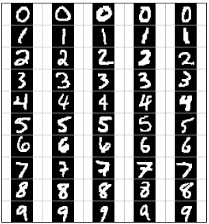
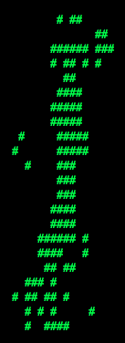
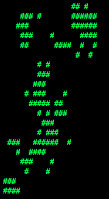
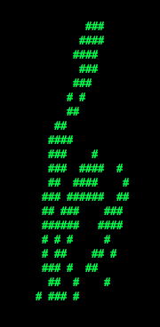
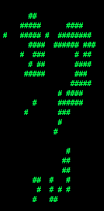
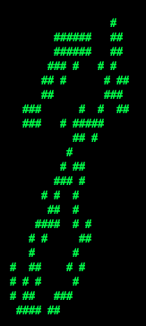
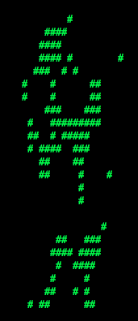
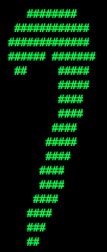
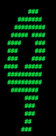

## Project 6: Classification Python project for CPSC 471/510


<center>Version Python 3</center>

> NOTE: This version uses Python 3. On some systems you might need to invoke `python3`

* * *

### Table of Contents

 *   [Introduction](#Introduction)
 *   [Q1: Perceptron](#Q1)
 *   [Q2: Perceptron Analysis](#Q2)
 *   [Q3: MIRA](#Q3)
 *   [Q4: Digit Feature Design](#Q4) - Extra credit
 *   [Q5: Behavioral Cloning](#Q5)
 *   [Q6: Pacman Feature Design](#Q6)

* * *

<center>

 ||
 ------|-----|
 Which Digit? | Which action? |

</center>

### <a name="Introduction"></a>Introduction

In this project, you will design three classifiers: a perceptron classifier, a large-margin (MIRA) classifier, and a slightly modified perceptron classifier for behavioral cloning. You will test the first two classifiers on a set of scanned handwritten digit images, and the last on sets of recorded pacman games from various agents. Even with simple features, your classifiers will be able to do quite well on these tasks when given enough training data.

Optical character recognition ([OCR](http://en.wikipedia.org/wiki/Optical_character_recognition)) is the task of extracting text from image sources. The data set on which you will run your classifiers is a collection of handwritten numerical digits (0-9). This is a very commercially useful technology, similar to the technique used by the US post office to route mail by zip codes. There are systems that can perform with over 99% classification accuracy (see [LeNet-5](http://yann.lecun.com/exdb/lenet/index.html) for an example system in action).

Behavioral cloning is the task of learning to copy a behavior simply by observing examples of that behavior. In this project, you will be using this idea to mimic various pacman agents by using recorded games as training examples. Your agent will then run the classifier at each action in order to try and determine which action would be taken by the observed agent.

The code for this project includes the following files and data, which is available in this repository.

<table class="intro" border="0" cellpadding="10">

<tbody>

<tr>

<td colspan="2"> <h4>Data file</h4> </td>

</tr>

<tr>

<td>`data.zip`</td>
<td>Data file, including the digit and face data.</td>

</tr>

<tr>

<td colspan="2"> <h4>Files you will edit</h4> </td>

</tr>

<tr>

<td>`perceptron_pacman.py`</td>

<td>The location where you will write your behavioral cloning perceptron classifier.</td>

</tr>

<tr>

<td>`perceptron.py`</td>

<td>The location where you will write your perceptron classifier.</td>

</tr>

<tr>

<td>`mira.py`</td>

<td>The location where you will write your MIRA classifier.</td>

</tr>

<tr>

<td>`data_classifier.py`</td>

<td>The wrapper code that will call your classifiers. You will also write your enhanced feature extractor here. You will also use this code to analyze the behavior of your classifier.</td>

</tr>

<tr>

<td>`answers.py`</td>

<td>Answer to Question 2 goes here.</td>

</tr>

<tr>

<td colspan="2"> <h4>Files you should read but NOT edit</h4> </td>

</tr>

<tr>

<td>`classification_method.py`</td>

<td>Abstract super class for the classifiers you will write.
(You <h4>should</h4> read this file carefully to see how the infrastructure is set up.)</td>

</tr>

<tr>

<td>`samples.py`</td>

<td>I/O code to read in the classification data.</td>

</tr>

<tr>

<td>`util.py`</td>

<td>Code defining some useful tools. You may be familiar with some of these by now, and they will save you a lot of time.</td>

</tr>

<tr>

<td>`most_frequent.py`</td>

<td>A simple baseline classifier that just labels every instance as the most frequent class.</td>

</tr>

</tbody>

</table>

**Files to Edit and Submit:** You will fill in portions of `perceptron.py`, `perceptron_pacman.py`, `mira.py`, `answers.py`, and `data_classifier.py` (only) during the assignment, and submit them. You should submit these files with your code and comments. Please _do not_ change the other files in this distribution or submit any of our original files other than this file.

**Evaluation:** Your code will be autograded for technical correctness. Please _do not_ change the names of any provided functions or classes within the code, or you will wreak havoc on the autograder. However, the correctness of your implementation -- not the autograder's judgements -- will be the final judge of your score. If necessary, we will review and grade assignments individually to ensure that you receive due credit for your work.

**Academic Dishonesty:** We will be checking your code against other submissions in the class for logical redundancy. If you copy someone else's code and submit it with minor changes, we will know. These cheat detectors are quite hard to fool, so please don't try. We trust you all to submit your own work only; _please_ don't let us down. If you do, we will pursue the strongest consequences available to us.

**Getting Help:** You are not alone! If you find yourself stuck on something, contact the course staff for help. Office hours, section, and the discussion forum are there for your support; please use them. If you can't make our office hours, let us know and we will schedule more. We want these projects to be rewarding and instructional, not frustrating and demoralizing. But, we don't know when or how to help unless you ask.

**Discussion:** Please be careful not to post spoilers.

* * *

### <a name="Q1"></a>Question 1 (5 points): Perceptron

A skeleton implementation of a perceptron classifier is provided for you in `perceptron.py`. In this part, you will fill in the `train` function.

Unlike the naive Bayes classifier, a perceptron does not use probabilities to make its decisions. Instead, it keeps a weight vector $`w^y`$ of each class $`y`$ ( $`y`$ is an identifier, not an exponent). Given a feature list $`f`$, the perceptron compute the class $`y`$ whose weight vector is most similar to the input vector $`f`$. Formally, given a feature vector $`f`$ (in our case, a map from pixel locations to indicators of whether they are on), we score each class with:

```math
\mathrm{score}(f,y) = \sum_i f_i w^y_i
```

Then we choose the class with highest score as the predicted label for that data instance. In the code, we will represent $`w^y`$ as a `Counter`.

#### Learning weights

In the basic multi-class perceptron, we scan over the data, one instance at a time. When we come to an instance $`(f, y)`$, we find the label with highest score:

```math
y' = \arg\max\limits_{y''}\mathrm{score}(f,y'')
```

We compare $`y'`$ to the true label $`y`$. If $`y' = y`$, we've gotten the instance correct, and we do nothing. Otherwise, we guessed $`y'`$ but we should have guessed $`y`$. That means that $`w^y`$ should have scored $`f`$ higher, and $`w^{y'}`$ should have scored $`f`$ lower, in order to prevent this error in the future. We update these two weight vectors accordingly:

```math
w^y = w^y + f
```

```math
w^{y'} = w^{y'} - f
```

Using the addition, subtraction, and multiplication functionality of the `Counter` class in `util.py`, the perceptron updates should be relatively easy to code. Certain implementation issues have been taken care of for you in `perceptron.py`, such as handling iterations over the training data and ordering the update trials. Furthermore, the code sets up the `weights` data structure for you. Each legal label needs its own `Counter` full of weights.

#### Question

Fill in the `train` method in `perceptron.py`. Run your code with:

<pre>python data_classifier.py -c perceptron </pre>

**Hints and observations:**

*   The command above should yield validation accuracies in the range between 40% to 70% and test accuracy between 40% and 70% (with the default 3 iterations). These ranges are wide because the perceptron is a lot more sensitive to the specific choice of tie-breaking than naive Bayes.
*   One of the problems with the perceptron is that its performance is sensitive to several practical details, such as how many iterations you train it for, and the order you use for the training examples (in practice, using a randomized order works better than a fixed order). The current code uses a default value of 3 training iterations. You can change the number of iterations for the perceptron with the `-i iterations` option. Try different numbers of iterations and see how it influences the performance. In practice, you would use the performance on the validation set to figure out when to stop training, but you don't need to implement this stopping criterion for this assignment.


* * *

### <a name="Q2"></a>Question 2 (1 point): Perceptron Analysis

#### Visualizing weights

Perceptron classifiers, and other discriminative methods, are often criticized because the parameters they learn are hard to interpret. To see a demonstration of this issue, we can write a function to find features that are characteristic of one class. (Note that, because of the way perceptrons are trained, it is not as crucial to find odds ratios.)

#### Question

I have filled in `find_high_weight_features(self, label)` in `perceptron.py`. It returns a list of the 100 features with highest weight for that label. You can display the 100 pixels with the largest weights using the command:

<pre>python data_classifier.py -c perceptron -w  </pre>

Use this command to look at the weights, and answer the following question. Which of the following sequence of weights is most representative of the perceptron?

<center>


Classifier | 0 | 1 | 2 | 3 | 4 | 5 | 6 | 7 | 8 | 9 |
--------|---|---|---|---|---|---|---|---|---|---|
**(a)** |  |  |  |  |  |  |  |  |  |  |
**(b)** |  |  |  |  |  |  |  |  |  |  |


</center>

Answer the question `answers.py` in the method `q2`, returning either 'a' or 'b'.


* * *

### <a name="Q3"></a>Question 3 (5 points): MIRA

A skeleton implementation of the MIRA classifier is provided for you in `mira.py`. MIRA is an online learner which is closely related to both the support vector machine and perceptron classifiers. You will fill in the `train_and_tune` function.

#### Theory

But return to this description after reading the theory section, as there are minor adjustments in the  text.

Similar to a multi-class perceptron classifier, multi-class MIRA classifier also keeps a weight vector w^y of each label $`y`$. We also scan over the data, one instance at a time. When we come to an instance (f, y), we find the label with highest score:

```math
y' = \arg\max\limits_{y''}\mathrm{score}(f,y'')
```


We compare $`y'`$ to the true label $`y`$. If $`y' = y`$, we've gotten the instance correct, and we do nothing. Otherwise, we guessed $`y'`$ but we should have guessed $`y`$. Unlike the perceptron, we update the weight vectors of these labels with a variable step size:

```math
w^y = w^y + \tau f
```

```math
w^{y'} = w^{y'} - \tau f
```

Where $` \tau \geq 0 `$ is chosen such that it minimizes

```math
\min\limits_{w'} \frac{1}{2} \sum\limits_{c} ||(w')^c - w^c ||_2^2
```

subject to the condition that $`(w')^y f \geq (w')^{y'} f + 1`$

which is equivalent to

```math
\min\limits_{\tau} ||\tau f ||_2^2  \medspace\mathrm{subject}\medspace\mathrm{to}\medspace \tau \geq \frac{(w^{y'} - w^y)f + 1}{2 ||f
||_2^2}  \medspace\mathrm{and}\medspace  \tau \geq 0
```

Note that, $`w^{y'}f \geq w^y f `$, so the condition $` \tau \geq 0 `$ is always true given $` \tau \geq \frac{(w^{y'} - w^y)f + 1}{2 ||f||_2^2} `$. Solving this simple problem, we then have

```math
\tau = \frac{(w^{y'} - w^y)f + 1}{2||f||_2^2}
```


However, we would like to cap the maximum possible value of $` \tau `$ by a positive constant $C$, which leads us to

```math
\tau = \min ( C, \frac{(w^{y'} - w^y)f + 1}{2||f||_2^2} )
```


#### Question

Implement `train_and_tune` in `mira.py`. This method should train a MIRA classifier using each value of _C_ in `Cgrid`. Evaluate accuracy on the held-out validation set for each _C_ and choose the _C_ with the highest validation accuracy. In case of ties, prefer the _lowest_ value of _C_. Test your MIRA implementation with:

<pre>python data_classifier.py -c mira --autotune </pre>

**Hints and observations:**

*   Pass through the data `self.max_iterations` times during training.
*   Store the weights learned using the best value of _C_ at the end in `self.weights`, so that these weights can be used to test your classifier.
*   To use a fixed value of _C=0.001_, remove the `--autotune` option from the command above.
*   Validation and test accuracy when using `--autotune` should be around the 60's.
*   It might save some debugging time if the +1 term above is implemented as +1.0, due to division truncation of integer arguments. Depending on how you implement this, it may not matter.
*   I have already implemented the code for returning high odds features and the high weights to allow you to visualize the results using the `-o` or `-w` options as described in question 2 for the perceptron, if you're curious what your classifier is learning.


* * *

### <a name="Q4"></a>Question 4 (5 points extra credit): Digit Feature Design

I have left this question in the autograder, but you are not required to do this question for CPSC 471/510.

I will give you extra credit provided the feature design is your own work, and not from online search! (Do NOT reference online materials for this extra credit (claiming extra credit for work not your own is an honor code violation!).)

Building classifiers is only a small part of getting a good system working for a task. Indeed, the main difference between a good classification system and a bad one is usually not the classifier itself (e.g. perceptron vs. naive Bayes), but rather the quality of the features used. So far, we have used the simplest possible features: the identity of each pixel (being on/off).

To increase your classifier's accuracy further, you will need to extract more useful features from the data. The `EnhancedFeatureExtractorDigit` in `data_classifier.py` is your new playground. When analyzing your classifiers' results, you should look at some of your errors and look for characteristics of the input that would give the classifier useful information about the label. You can add code to the `analysis` function in `data_classifier.py` to inspect what your classifier is doing. For instance in the digit data, consider the number of separate, connected regions of white pixels, which varies by digit type. 1, 2, 3, 5, 7 tend to have one contiguous region of white space while the loops in 6, 8, 9 create more. The number of white regions in a 4 depends on the writer. This is an example of a feature that is not directly available to the classifier from the per-pixel information. If your feature extractor adds new features that encode these properties, the classifier will be able exploit them. Note that some features may require non-trivial computation to extract, so write efficient and correct code.

_Note: You will be working with digits, so make sure you are using_ _DIGIT_DATUM_WIDTH and_ _DIGIT_DATUM_HEIGHT, instead of FACE_DATUM_WIDTH and FACE_DATUM_HEIGHT._

#### Question

Add new binary features for the digit dataset in the `EnhancedFeatureExtractorDigit` function. Note that you can encode a feature which takes 3 values [1,2,3] by using 3 binary features, of which only one is on at the time, to indicate which of the three possibilities you have. In theory, features aren't conditionally independent as naive Bayes requires, but your classifier can still work well in practice. We will test your classifier with the following command:

<pre>python data_classifier.py -d digits -c naiveBayes -f -a -t 1000  </pre>

With the basic features (without the `-f` option), your optimal choice of smoothing parameter should yield 82% on the validation set with a test performance of 78%. You will receive 3 points for implementing new feature(s) which yield any improvement at all. You will receive 3 additional points if your new feature(s) give you a test performance greater than or equal to 84% with the above command.


* * *

### <a name="Q5"></a>Question 5 (4 points): Behavioral Cloning

You have built two different types of classifiers, a perceptron classifier and mira. You will now use a modified version of perceptron in order to learn from pacman agents. In this question, you will fill in the classify and train methods in `perceptron_pacman.py`. This code should be similar to the methods you've written in `perceptron.py.`

For this application of classifiers, the data will be states, and the labels for a state will be all legal actions possible from that state. Unlike perceptron for digits, all of the labels share a single weight vector $`w`$, and the features extracted are a function of both the state and possible label.

For each action, calculate the score as follows:

```math
\mathrm{score} (s, a) = w*f(s, a)
```

Then the classifier assigns whichever label receives the highest score:

```math
a' = \arg\max\limits_{a''} \mathrm{score} (s,a'')
```

Training updates occur in much the same way that they do for the standard classifiers. Instead of modifying two separate weight vectors on each update, the weights for the actual and predicted labels, both updates occur on the shared weights as follows:

Correct action: $`w = w + f(s,a)`$

Guessed action: $`w = w - f(s,a')`$

#### Question

Fill in the `train` method in `perceptron_pacman.py`. Run your code with:

`python data_classifier.py -c perceptron -d pacman`

This command should yield validation and test accuracy of over 70%.

* * *


### <a name="Q6"></a>Question 6 (5 points): Pacman Feature Design

In this part you will write your own features in order to allow the classifier agent to clone the behavior of observed agents. We have provided several agents for you to try to copy behavior from:

*   **StopAgent**: An agent that only stops
*   **FoodAgent**: An agent that only aims to eat the food, not caring about anything else in the environment.
*   **SuicideAgent**: An agent that only moves towards the closest ghost, regardless of whether it is scared or not scared.
*   **ContestAgent**: A staff agent from p2 that smartly avoids ghosts, eats power capsules and food.

We've placed files containing multiple recorded games for each agent in the data/pacmandata directory. Each agent has 15 games recorded and saved for training data, and 10 games for both validation and testing.

#### Question

Add new features for behavioral cloning in the `EnhancedPacmanFeatures` function in `data_classifier.py`.

Upon completing your features, you should get at least 90% accuracy on the ContestAgent, and 80% on each of the other 3 provided agents. You can directly test this using the `--agentToClone <Agent name>, -g <Agent name>` option for data_classifier.py:

`python data_classifier.py -c perceptron -d pacman -f -g ContestAgent -t 1000 -s 1000`

#### Other helpful options:

We have also provided a new ClassifierAgent, in pacmanAgents.py, for you that uses your implementation of perceptron_pacman. This agent takes in training, and optionally validation, data and performs the training step of the classifier upon initialization. Then each time it makes an action it runs the trained classifier on the state and performs the returned action. You can run this agent with the following command:

`python pacman.py -p ClassifierAgent --agentArgs trainingData=<path to training data>`

E.g.
`python pacman.py -p ClassifierAgent --agentArgs trainingData=pacmandata/contest_training.pkl`

You can also use the `--agentToClone <Agent Name>` option to use one of the four agents specified above to train on:

`python pacman.py -p ClassifierAgent --agentArgs agentToClone=<Agent Name>`
E.g.
`python pacman.py -p ClassifierAgent --agentArgs agentToClone=ContestAgent`

* * *

### Submission

You're not done yet! Submit your code to your gitlab fork of this project.

If you are working in a group, make sure you do a final fork to your personal group.
